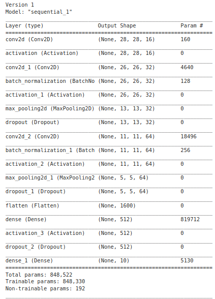

***

# Fashion-MNIST CNN Benchmarking Accuracy upto ~98%)

<summary>Table of Contents</summary>

- [Fashion-MNIST CNN Benchmarking Accuracy upto ~98%)](#fashion-mnist-cnn-benchmarking-accuracy-upto-98)
  - [Introduction:](#introduction)
  - [Dependencies:](#dependencies)
  - [Run Instructions](#run-instructions)
  - [Options for main.py](#options-for-mainpy)
  - [Approach](#approach)
  - [Results:](#results)
  - [Future Work](#future-work)


## Introduction:

Fashion MNIST is a dataset which is meant to replace tradidional MNIST dataset, because it is over cited in many research papers now. It is super easy to get high accuracy results with classic MNIST-dataset. If you haven't hear about FASHION MNIST dataset before please visit the official github repository to understand the challenge --> https://github.com/zalandoresearch/fashion-mnist, before you continue reading this project. If you already are aware of the dataset, this repository will give you an idea how you can create your deepCNN models in order to achieve as high accuracy as 98%.


## Dependencies:

Complete dependencies for this project are written in requirements.txt file.

Main Dependencies:
- Jupyterlab
- scikit-learn
- tensorflow [CPU/GPU], according to your machine, I have run this entire project on my notebook with Quadro 3000 GPU.
- numpy
- scikit-image

Proposed Optionals:
- Ubuntu OS
- python3.7.5 or above
- virtualenv
- pip 20.0.2 or above

## Run Instructions

This project was run on Ubuntu environment, this is not a dependency, but Windows machine was not tested(It would most probably still work on windows). Feel free to contact me for any troubleshooting.

Proposed steps for a virtualenvironment Setup:

```shell
Step1:
virtualenv env_name -p python3 

Step2:
source env_name/bin/activate

Step3:
pip install -e .
```

Now you should be ready to start training the models provided with this repository. You can run the main.py file, or simply browse throguh the provided notebooks. Below you find a sample training command in case you like CLIs.

Sample Train command:
	
- python code/main.py --mode train --num_epochs 10


## Options for main.py
To check all the options that are provided for flexibilty run below command and feel to play around with these parameters. TO achieve the results run the default parameters.

-	python code/main.py --help


## Approach

After trying different modifications to the network architecture (like Batch Normalization, different Dropout regularizers) and data Augmentation techniques, I think following 3 models are worth showing the evolution where I was able to reach train accuracy of upto ~98.9%

| Architecture 1: 
---------------|
- Conv => Conv => MaxPool => Dropout => Conv => MaxPool => Dropout
- 1 FC Layer

| |
 
 | Architecture 2:
 -----------------|
 - 2-blocks of Conv => MaxPool => Dropout 
 - 1 FC-layer
 - Filter Size of 4x4
 
  |

 |Architecture 3- VGG_Like
 -----------------|
 
 - 2 sets of CONV => RELU => CONV => RELU => POOL block 
 - and only 1 FC block, 
 - Always using kernel size of 3 with stride 1.
  
   |


## Results:
- Training accuracy of upto <b>98.9%</b> was achieved with VGG-Like model. Below you can find the Time complexity, paramters and accuracy comparision for the above 3 model architecture

| Model | num_parameters | Time taken in secs(10 epoch) | Accuracy Achieved(10 epoch) |
|---------------|-----------------|-----------------|-----------------|
|arch 1 |  848,330 | 52 secs | 91.34% |
|arch 2 |  493,772 | 167 secs | 93.02% |
|arch 3 |  1,677,674 | 257 secs | 94.8% |
|arch 3(80-epochs) |  1,677,674 | 2180 secs | 97% |

From here on below results were gathered on the VGG-Like model trained for 80 epochs.

Below you see how model accuracy is evolving over epoch.


I also plotted a <b>Confusion Matrix</b> to see which Classes are learnt well by the network. As can be seen in the confusion matrix the model gets confused quite a lot between "T-shirt-Top" and a "shirt", these 2 classes are quite difficult to distinguish.


Furthermore maybe accuracy metrix is not good enough, we should also know how precise the model is, therefore for further evalutation, metrix like <b>F-1 Score</b>, <b>Precision</b>, <b>Recall</b> were also calculated and the results are shown below.


| Class | Name | precision | recall | F1-Score |
|-------|------|-----------|--------|----------|
| 0  | T-Shirt/Top  | 0.90|    0.91|      0.90|
| 1  | Trouser      | 1.00|    0.99|      0.99|
| 2  | Pullover     | 0.93|    0.93|      0.93|
| 3  | Dress        | 0.94|    0.96|      0.95|
| 4  | Coat         | 0.91|    0.93|      0.92|
| 5  | Sandal       | 0.99|    1.00|      0.99|
| 6  | Shirt        | 0.86|    0.82|      0.84|
| 7  | Sneaker      | 0.97|    0.99|      0.98|
| 8  | Bag          | 0.99|    0.99|      0.99|
| 9  | AnkleBoot    | 0.99|    0.97|      0.98|
||
||accuracy|  0.95|
||macro avg|       0.95      |0.95|      0.95|  
||weighted avg|       0.95      |0.95|      0.95|


## Future Work

- More DataAugmentation: to further improve the results. If you carefully read the DataLoader code(util/dataLoader.py) which uses  ImageDataGenerator, where you can easily add already existing image-Augmentation techniques

- Utilize TransferLearning Approach.